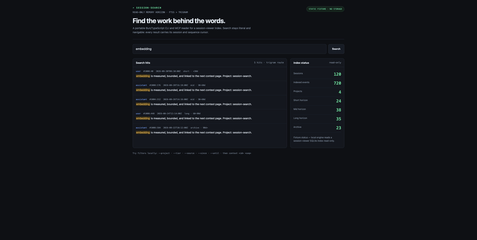

# session-search

> A Bun/TypeScript CLI + MCP server that adds a memory horizon to a local
> session-viewer SQLite index: Thai-safe full-text search, time buckets, and
> navigable context.

**[Open the public static fixture demo](https://session-search-fixture-demo.laris.workers.dev/)**



The public demo is a real search-shaped browser surface backed by **120
synthetic sessions and 720 synthetic events**. It has no KV, D1, R2, database,
filesystem access, secrets, telemetry, or persistence. It never contains a
private transcript.

## Local CLI

```bash
bun install
export SESSION_VIEWER_DB="$HOME/.session-viewer/sessions.db"
bun run cli search "กระจก" --tier session --limit 20
bun run cli horizons
bun run cli context 1234 80 --before 4 --after 6
bun run cli session 1234 --from 1 --limit 30
bun run cli mcp
```

`session-search` is intentionally **read-only**. It does not create a schema,
import files, or write rows: `session-viewer` owns the index. Pass `--db` or
set `SESSION_VIEWER_DB` to choose the local database. No local database or
JSONL corpus is bundled here.

## Search model

- queries under three characters use the unicode61 FTS5 index;
- longer queries use the FTS5 trigram index for substring-safe Thai search;
- optional filters: `project`, `tier`, `source`, `since`, and `until`;
- every hit includes `session id + seq`, the cursor for `context`.

## Public fixture deployment

`worker/index.ts` mirrors the public shape with deterministic fixtures only.
`wrangler.toml` declares one binding: static Cloudflare `ASSETS`.

## Documentation

- [HOW-IT-WORKS.md](HOW-IT-WORKS.md) — local read-only flow and query routing
- [docs/public-demo-gallery.md](docs/public-demo-gallery.md) — rendered screenshots
- [SPEC.md](SPEC.md) — design decisions and measured trade-offs

## License

[MIT](LICENSE) © 2026 Soul Brews Studio.
